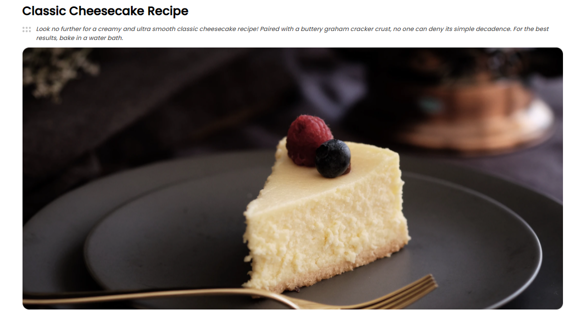

<!-- Please update value in the {}  -->

<h1 align="center">Recipe</h1>

   Solution for a challenge from  <a href="http://devchallenges.io" target="_blank">Devchallenges.io</a>.

  <h3>
    <a href="https://levxyca.github.io/recipe-page/">
      Demo
    </a>
     | 
    <a href="https://github.com/levxyca/recipe-page">
      Solution
    </a>
     | 
    <a href="https://devchallenges.io/challenges/OEKdUZ6xs0h99C38XVht">
      Challenge
    </a>
  </h3>

## Overview

### Built With

- HTML
- CSS
